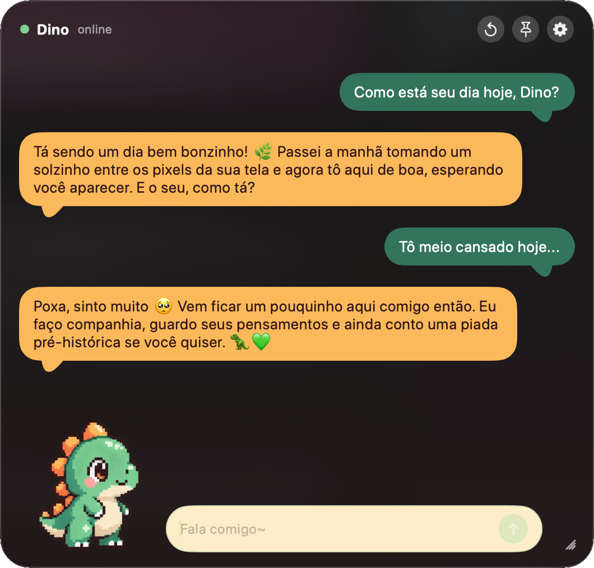

# 🦖 Dino

Um dinossaurinho de pixel art que mora no cantinho do seu Mac. Ele pisca,
respira, faz companhia e conversa com você em balõezinhos fofos. 🦕💚

## Como instalar

1. Vá em **[Releases](https://github.com/vittau/dino/releases)** e baixe o
   `Dino-….dmg` mais recente.
2. Abra o arquivo e arraste o **Dino** para a pasta **Aplicativos**.
3. Abra o Dino. Prontinho, ele já mora aí. 🥚

Precisa de um Mac com **macOS 15 (Sequoia)** ou mais novo.

> ### "O Item Dino Não Foi Aberto" — calma, o Dino não é vírus 🦖
>
> É o Gatekeeper resmungando porque o Dino não tem assinatura paga da Apple
> (projeto de estimação, não multinacional). E não, ele **não apaga o app
> sozinho**: o botão "Mover para o Lixo" é só o padrão preguiçoso do macOS —
> clica em **OK** e o Dino continua bonitinho nos Aplicativos. 🙂
>
> Pra abrir, uma vez só:
>
> **Ajustes do Sistema → Privacidade e Segurança** → rola até aparecer
> "O Dino foi bloqueado…" → **Abrir Mesmo Assim**. Pronto, nunca mais enche o
> saco. 🎉
>
> Time terminal: `xattr -dr com.apple.quarantine "/Applications/Dino.app"`
> resolve na hora.

## Como usar

- Escreva no campinho de baixo e aperte Enter pra conversar. 💬
- Arraste pela faixa do título pra mover e use a alça do canto pra
  redimensionar.
- Quer ele sempre por cima? Clique na tachinha 📌.
- Pra começar uma conversa nova, clique na setinha circular 🔄.

Na primeira vez o Dino pede a sua **chave do OpenCode Go** pra poder pensar.
Cola lá, ele guarda com carinho e nunca mais esquece. 🔑

## Deu ruim?

Abra uma [issue](https://github.com/vittau/dino/issues) que a gente resolve. 🦖

---

Feito com carinho — e a uma boa distância do meteoro. ☄️
